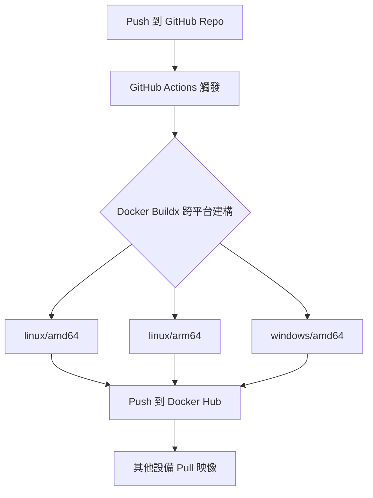

# mermaid

```mermaid

graph TD
  A[Push 到 GitHub Repo] --> B[GitHub Actions 觸發]
  B --> C{Docker Buildx 跨平台建構}
  C --> D[linux/amd64]
  C --> E[linux/arm64]
  C --> F[windows/amd64]
  D & E & F --> G[Push 到 Docker Hub]
  G --> H[其他設備 Pull 映像]
```
