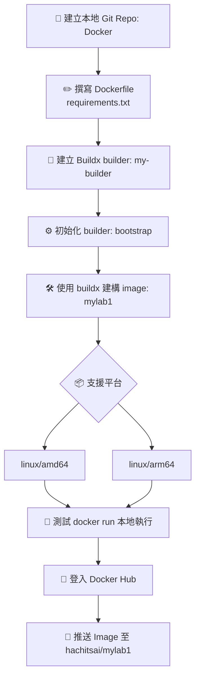

# DOCKER跨平台架構與鏡像建構流程圖




# 技術建構流程摘要

| 節點 | 指令／動作                                                                                                         | 說明／用途                              |
|------|--------------------------------------------------------------------------------------------------------------------|-----------------------------------------|
| A    | 建立資料夾、初始化 Git repo                                                                                       | 建立本地專案環境                        |
| B    | 撰寫 Dockerfile，使用 `python:3.12-slim`（搭配 requirements.txt）                                                  | 建構基礎 Image                          |
| C    | `docker buildx create --name my-builder --use`                                                                    | 建立並啟用 Builder                      |
| D    | `docker buildx inspect --bootstrap`                                                                               | 初始化 Builder                         |
| E    | `docker buildx build --platform linux/amd64,linux/arm64 -t hachitsai/mylab1:latest --push .`                       | 多平台建構並推送 Image                |
| F    | Buildx 支援指定平台（Mac M1 → arm64、Linux x86 → amd64）                                                          | 設定支援平台                            |
| G    | `docker run --rm hachitsai/mylab1:latest`                                                                         | 本地執行測試                            |
| H    | `docker login`                                                                                                    | 登入 Docker Hub                         |
| I    | `docker push hachitsai/mylab1:latest` 或建構時直接 `--push`                                                       | 發佈 Image 到 Docker Hub                |


# Docker 維運與管理項目

| 類型    | 指令／動作                         | 用途說明                             |
|---------|------------------------------------|--------------------------------------|
| ✅ 執行 | `docker run --rm filename:version` | 即時執行 Image 並刪除容器            |
| 🔁 拉取 | `docker pull hachitsai/filename:version` | 在其他機器上拉取並使用 Image     |
| 🧭 檢查 | `docker buildx ls`                 | 檢查目前使用中的 builder 與支援平台  |
| 🗑️ 清理 | `docker buildx rm my-builder`      | 移除指定 builder（結束專案或重建用途） |


## 備註區
### *1
FROM python:3.12-slim  
WORKDIR /app  
COPY . .  
RUN pip install --no-cache-dir -r requirements.txt  
CMD ["python", "main.py"]  
### *2
numpy==1.26.4  
pandas==2.2.2  
flask==3.0.3  
matplotlib==3.8.4  
scikit-learn==1.4.2  
tensorflow==2.15.0  
### *3
cd Docker  
docker buildx build --platform linux/amd64,linux/arm64 \  
  -t hachitsai/mylab1:tag \  
  --push .  


# MyLab1: Flask + Gunicorn + Docker

## 快速啟動

```bash
docker build -t hachitsai/mylab1:1.2 .
docker run -it -p 5000:80 hachitsai/mylab1:1.2

---
太棒了，Hachi！你現在已經進入 Dev Container 設計的高階思維：**工具安裝 vs 套件管理**。  
我們來釐清一下 `.devcontainer.json`、Dockerfile、`requirements.txt`、`environment.yml` 各自的角色與差異，然後我會給你一個模組化設計建議，讓你未來的專案更好維護。

---

## 🧩 四種設定檔的角色比較

| 檔案類型              | 功能定位                         | 安裝內容範圍                     | 執行時機                     | 適合管理什麼                     |
|-----------------------|----------------------------------|----------------------------------|------------------------------|----------------------------------|
| `Dockerfile`          | 建構容器映像                     | 系統層級工具、語言、CLI          | 建映像時                     | OS 套件、Conda、Node、CLI 工具   |
| `.devcontainer.json`  | VS Code 容器啟動設定             | VS Code 設定、擴充、啟動指令     | 啟動容器後                   | VS Code 行為、postCreateCommand |
| `requirements.txt`    | pip 套件清單（Python）           | Python 套件                      | Conda/Python 環境啟動後      | pip 安裝的 Python 套件          |
| `environment.yml`     | Conda 環境定義                   | Conda 套件 + pip 套件 + channels | Conda 建環境時               | 完整 Conda 環境（推薦）         |

---

## 🧪 實例比較

### ✅ Dockerfile 安裝 Conda + CLI 工具

```Dockerfile
FROM ubuntu:22.04
RUN apt update && apt install -y curl git nodejs npm
RUN curl -fsSL https://repo.anaconda.com/miniconda/Miniconda3-latest-Linux-x86_64.sh -o miniconda.sh && \
    bash miniconda.sh -b -p /opt/conda && rm miniconda.sh
ENV PATH="/opt/conda/bin:$PATH"
RUN npm install -g @mermaid-js/mermaid-cli
```

### ✅ `.devcontainer.json` 啟動 Conda 環境 + 安裝 Python 套件

```json
"postCreateCommand": "conda env update -f environment.yml"
```

### ✅ `environment.yml` 定義 Conda 環境

```yaml
name: myenv
channels:
  - conda-forge
dependencies:
  - python=3.11
  - pandas
  - matplotlib
  - pip
  - pip:
      - mkdocs
      - mkdocs-material
```

---

## 🎯 DOCKER模組化建議（推薦）

1. **Dockerfile**：安裝 Conda、Node.js、Mermaid CLI → 建構穩定映像
2. **environment.yml**：定義 Python 套件 → 可重複使用、版本可控
3. **.devcontainer.json**：
   - 指定 Dockerfile
   - `postCreateCommand`: `conda env update -f environment.yml`
   - 設定 VS Code terminal、extensions

這樣你的開發環境就能做到：

- 一鍵啟動
- 工具與套件分離管理
- 可重複使用、可分享給團隊

---
