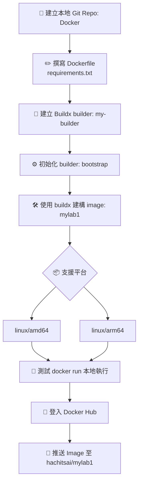

# DOCKER跨平台架構與鏡像建構流程圖

# 技術建構流程摘要

| 節點 | 指令／動作                                                                                                         | 說明／用途                              |
|------|--------------------------------------------------------------------------------------------------------------------|-----------------------------------------|
| A    | 建立資料夾、初始化 Git repo                                                                                       | 建立本地專案環境                        |
| B    | 撰寫 Dockerfile，使用 `python:3.12-slim`（搭配 requirements.txt）                                                  | 建構基礎 Image                          |
| C    | `docker buildx create --name my-builder --use`                                                                    | 建立並啟用 Builder                      |
| D    | `docker buildx inspect --bootstrap`                                                                               | 初始化 Builder                         |
| E    | `docker buildx build --platform linux/amd64,linux/arm64 -t hachitsai/mylab1:latest --push .`                       | 多平台建構並推送 Image                |
| F    | Buildx 支援指定平台（Mac M1 → arm64、Linux x86 → amd64）                                                          | 設定支援平台                            |
| G    | `docker run --rm hachitsai/mylab1:latest`                                                                         | 本地執行測試                            |
| H    | `docker login`                                                                                                    | 登入 Docker Hub                         |
| I    | `docker push hachitsai/mylab1:latest` 或建構時直接 `--push`                                                       | 發佈 Image 到 Docker Hub                |

# Docker 維運與管理項目

| 類型    | 指令／動作                         | 用途說明                             |
|---------|------------------------------------|--------------------------------------|
| ✅ 執行 | `docker run --rm filename:version` | 即時執行 Image 並刪除容器            |
| 🔁 拉取 | `docker pull hachitsai/filename:version` | 在其他機器上拉取並使用 Image     |
| 🧭 檢查 | `docker buildx ls`                 | 檢查目前使用中的 builder 與支援平台  |
| 🗑️ 清理 | `docker buildx rm my-builder`      | 移除指定 builder（結束專案或重建用途） |

## 備註區
### *1
FROM python:3.12-slim  
WORKDIR /app  
COPY . .  
RUN pip install --no-cache-dir -r requirements.txt  
CMD ["python", "main.py"]  
### *2
numpy==1.26.4  
pandas==2.2.2  
flask==3.0.3  
matplotlib==3.8.4  
scikit-learn==1.4.2  
tensorflow==2.15.0  
### *3
cd Docker  
docker buildx build --platform linux/amd64,linux/arm64 \  
  -t hachitsai/mylab1:tag \  
  --push .  

